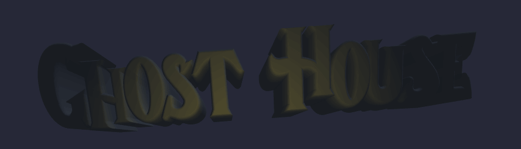
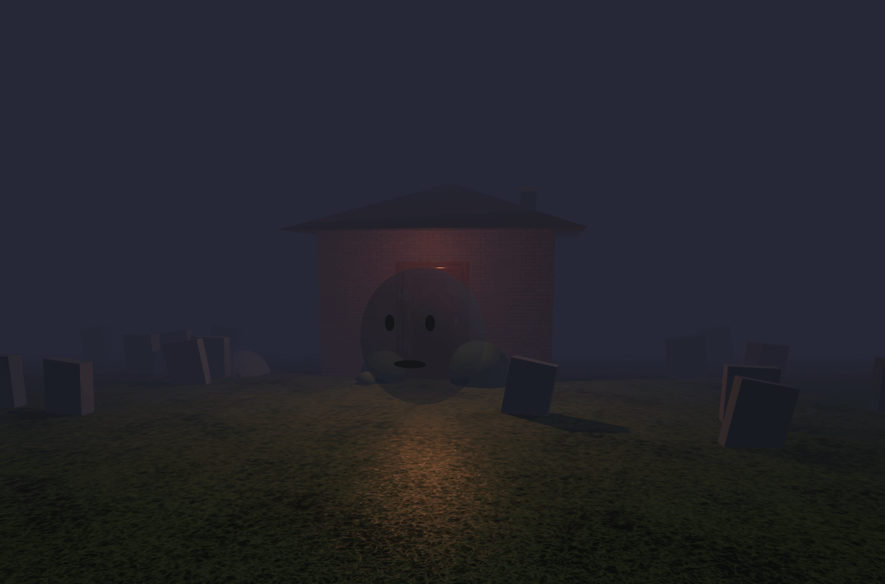
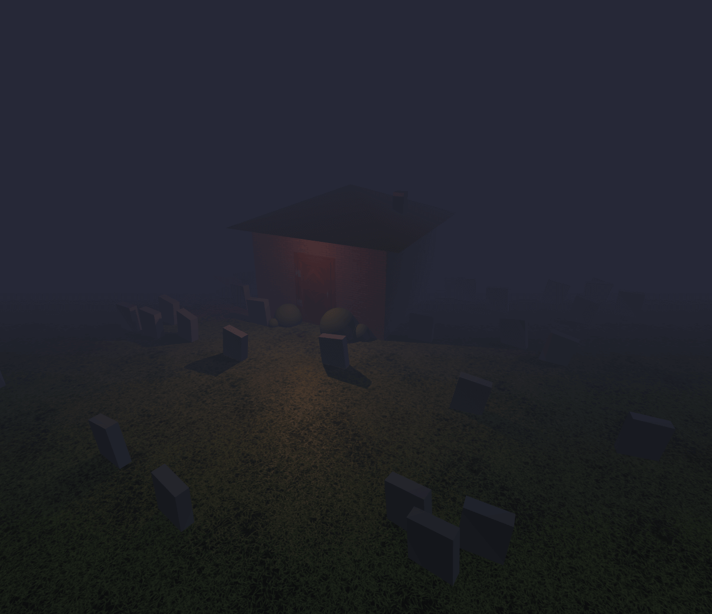

Made with Three.js. Based on an idea of Bruno Simon.

## Screenshots

## Plans
- Change existing textures with more appropriate ones
- Add textures to all elements
- Redesign ghosts
- Add details to house
- Add details to the garden/cemetary
- Expand world
- Create a mini-game

## License
[MIT License](https://opensource.org/licenses/MIT)
