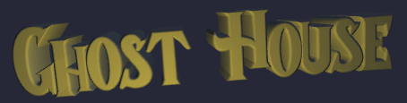
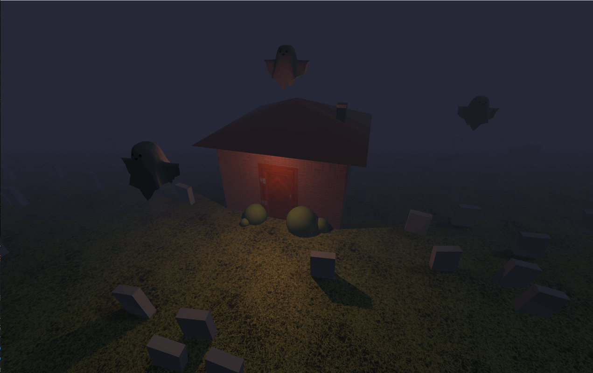
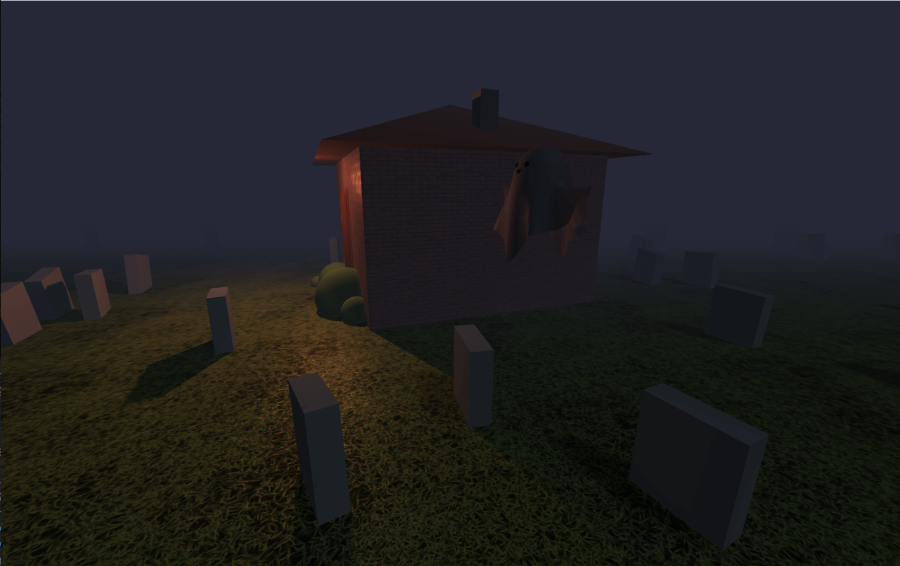
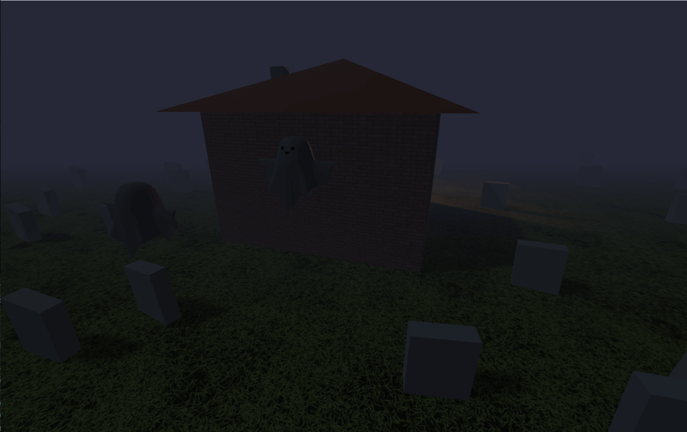
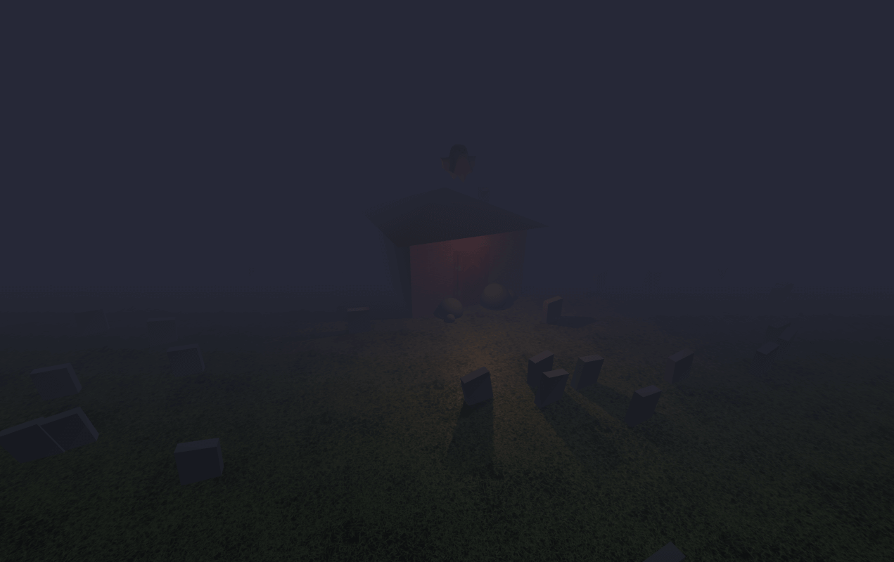

Made with Three.js.
Based on an idea by [Bruno Simon](https://github.com/brunosimon).

## Screenshots

## Changelog
- Imported ghost 3D model and changed floating lights to ghosts
- Added extra ghosts
- Set limits on camera movement and speed (pan, zoom, angles, etc.)
- Increased ground area
- Improved grave distribution
- Added logo with lighting
- Added short, disappearing instructions
- Added chimney

## Plans
- Change existing textures with more appropriate ones
- Add textures to all elements
- Improve ghost movement
- Add details to house
- Add details to the garden/cemetary
- Expand world
- Create a mini-game

## License
[MIT License](https://opensource.org/licenses/MIT)
